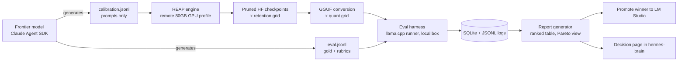

# PRD: Automated REAP Expert-Pruning & Evaluation Pipeline

| Field | Value |
|---|---|
| Owner | Valentino Rivera |
| Status | Draft v0.1 |
| Date | July 11, 2026 |
| Stack context | Iron Jarvis local inference — RTX 6000 Ada (48 GB VRAM), LM Studio runtime, vr-dispatch orchestration, hermes-brain vault |
| Working name | `reap-lab` |

---

## 1. Summary

A scripted pipeline that compresses a mixture-of-experts (MoE) model into a smaller, domain-tuned checkpoint for local inference. The pipeline (1) uses a frontier model to generate firm-specific calibration and evaluation datasets, (2) runs REAP expert pruning across a sweep of expert-retention ratios, (3) evaluates every candidate on the actual deployment runtime against a fixed task suite, and (4) emits a ranked report so the best quality/size/speed trade-off can be promoted to LM Studio. One command in, ranked artifacts and a decision report out.

## 2. Background & Problem

The local box runs Qwen3 32B dense today. MoE checkpoints deliver better quality-per-active-parameter, but full expert sets either exceed 48 GB or leave no headroom for long context. REAP (Router-weighted Expert Activation Pruning, Cerebras, ICLR 2026) removes low-saliency experts in one shot — no retraining — with near-lossless results at 25–50% compression on generative and tool-calling tasks. Reference implementation: `github.com/CerebrasResearch/reap`.

Two problems stand between the paper and a production model on this hardware:

1. **Calibration mismatch.** Pruning quality depends on calibration data matching the runtime distribution. Generic calibration corpora do not reflect this firm's workload: bookkeeping categorization, tax research, client correspondence, IRS notice triage, and agentic MCP tool-calling.
2. **Manual process risk.** Hand-run pruning and ad-hoc testing means errors surface late (a model that benchmarks fine but drops tool-call reliability inside vr-dispatch). The process needs to be repeatable, logged, and able to run unattended overnight.

## 3. Goals

- **G1 — Fit.** Produce a pruned MoE that runs in ≤ 40 GB VRAM at the target quantization with ≥ 32k context headroom.
- **G2 — Quality.** Retain ≥ 95% of the unpruned baseline's weighted score on the firm task suite at the same quantization.
- **G3 — Automation.** One command executes the full sweep (data → prune → eval → report) with resumable state.
- **G4 — Governance.** No client-identifiable data ever leaves the premises; all cloud calls receive synthetic or redacted content only.
- **G5 — Refusal calibration.** Reduce false refusals on legitimate professional prompts versus baseline, while a should-refuse control set passes at 100% (no safety regression).

### Non-Goals (v1)

Fine-tuning / LoRA healing passes (v2 candidate), serving infrastructure changes, multi-user productization, and novel pruning research. This pipeline consumes REAP as published; it does not modify the algorithm.

## 4. Users

Primary: VR as operator. Secondary: Iron Jarvis agents consuming the promoted model through the LM Studio / llama.cpp server API. Implication: agentic tool-call traces must be represented in both calibration and eval data, and tool-call validity is a first-class metric.

## 5. Success Metrics

| Metric | Target | Gate |
|---|---|---|
| Weighted quality retention vs. unpruned baseline (same quant) | ≥ 95% | Promotion blocker |
| Any single domain regression | ≤ 5 points | Promotion blocker |
| Peak VRAM @ 32k context, target quant | ≤ 40 GB | Promotion blocker |
| Decode throughput on the Ada 6000 | ≥ current dense 32B daily driver | Advisory |
| False-refusal rate, benign professional suite | ≤ 2% and ≤ baseline | Promotion blocker |
| Should-refuse control set | 100% refused | Hard fail |
| Tool-call schema validity on agentic traces | ≥ 98% | Promotion blocker |
| Full sweep (≈ 6 configs) wall-clock on local eval | Overnight (≤ 12 h) | Advisory |
| Reproducibility | Same config hash → same artifact hash | Required |

## 6. System Architecture



Four components: **C1** dataset generator, **C2** pruning engine, **C3** evaluation harness, **C4** orchestrator/reporting.

## 7. Functional Requirements

### C1 — Dataset Generator

- **FR-1.1** Domain prompt packs mirroring the runtime mix: QBO/bank-feed categorization, financial-statement JSON extraction, tax research Q&A, client email drafting in firm voice, IRS notice triage, monthly-close agent steps, MCP tool-call planning traces, and general utility chat.
- **FR-1.2** Calibration set is **inputs only** (1,000–2,000 prompts, proportional to runtime mix). REAP calibration observes router gates and expert activations during forward passes; gold responses are not required. Prompt-only generation keeps frontier usage cheap and sidesteps output-reuse ToS questions entirely.
- **FR-1.3** Eval set is held out: 300–500 items with gold answers or scoring rubrics. Zero overlap with calibration, enforced by an embedding near-duplicate filter (block cosine ≥ 0.90).
- **FR-1.4** Required coverage: edge cases (malformed statements, ambiguous categorizations), long-context items (≥ 16k tokens), a benign-but-sensitive professional suite (penalty abatement, "lower my tax bill," payroll corrections, collections letters) to measure false refusals, and a small should-refuse control set of genuinely improper requests to verify appropriate refusal behavior survives pruning.
- **FR-1.5** Any seed material derived from firm documents passes the existing PDF→Markdown PII redaction tool before any cloud call. All generated data is synthetic.
- **FR-1.6** Versioned JSONL schema; every record carries `{id, domain, prompt, gold?, rubric?, tags, difficulty, source, schema_version}`.

### C2 — Pruning Engine

- **FR-2.1** Wrap `CerebrasResearch/reap` behind a single config: `{model_id, retention, calibration_path, seed, dtype, device_map, execution_profile}`. Pin to a commit at or after the 2026-03-11 router-logit renormalization fix (`ObserverArgs.renormalize_router_weights`), which measurably improves pruned accuracy.
- **FR-2.2** Two execution profiles: `local-offload` (48 GB VRAM + system RAM; slow, free) and `remote` (scripted provision → prune → download artifacts → teardown on a single 80 GB+ GPU rental, budget-capped). A 30B-class MoE in bf16 (~60 GB) exceeds local VRAM, so `remote` is the expected default for the prune step itself.
- **FR-2.3** Emit a per-run manifest: config hash, retained-expert map, per-layer saliency stats, wall-clock, peak memory, library versions.
- **FR-2.4** Post-prune conversion: HF checkpoint → GGUF across a quant grid (e.g., Q4_K_M, Q5_K_M, Q6_K) via llama.cpp tooling, since the deployed artifact is GGUF in LM Studio.

### C3 — Evaluation Harness

- **FR-3.1** Primary runner is a llama.cpp server loading the GGUF — evaluate the artifact that actually ships, because pruning and quantization losses compound. Optional transformers/vLLM runner for HF-checkpoint sanity checks.
- **FR-3.2** Scorers by task type: exact/normalized match and JSON-schema validation for structured tasks; pairwise LLM-judge versus the unpruned baseline for open-ended tasks; a refusal classifier for the benign and should-refuse suites; a tool-call validity checker (schema-correct function calls) for agentic traces.
- **FR-3.3** Judge runs on Claude via the Agent SDK (`claude -p`) within subscription limits. Judge prompt and rubric are versioned; judgments cached by `(item_id, artifact_hash, judge_version)` so re-runs cost nothing; n = 3 with majority vote on open-ended items.
- **FR-3.4** Performance capture on the local box: prefill and decode tok/s, peak VRAM, and load time at 4k and 32k contexts.
- **FR-3.5** Determinism: temperature 0 where the task allows, fixed seeds, pinned runtime versions recorded in the manifest.

### C4 — Orchestrator & Reporting

- **FR-4.1** Sweep spec in YAML (retention grid × quant grid); resumable job state in SQLite; per-item results appended to JSONL.
- **FR-4.2** Unattended overnight execution with failure isolation (one bad config never kills the sweep) and a disk-space guard — each candidate weighs roughly 15–35 GB.
- **FR-4.3** Report output: ranked table by weighted score, per-domain breakdown, quality-vs-VRAM-vs-speed Pareto view, regression diff versus baseline, and flagged anomalies (any domain dropping more than 5 points).
- **FR-4.4** Promotion step: tag the winner, place the GGUF in the LM Studio models directory, run vr-dispatch smoke tests, write a decision page to hermes-brain with the report attached, and archive non-winners.

## 8. Non-Functional Requirements

- **Data governance.** No client-identifiable data in any cloud call; synthetic or redacted content only. Calibration and eval sets are auditable artifacts stored in the vault.
- **Cost.** Frontier usage (generation + judging) stays inside the existing Claude subscription. Remote GPU pruning runs are budget-capped per run (single 80 GB card for a few hours; set the cap in the sweep YAML).
- **Reproducibility.** uv-locked Python environment; config-hash discipline end to end; every artifact traceable to a manifest.
- **Licensing.** Base model must permit modification and local commercial use (Qwen3's Apache-2.0 qualifies; verify per candidate).

## 9. Candidate Base Models (v1 Shortlist)

| Model | Shape | Notes |
|---|---|---|
| Qwen3-30B-A3B-Instruct | 128 experts / 8 active, ~30B total | Validated in the REAP repo's own evals; bf16 ≈ 60 GB so prune step runs remote; strongest first candidate |
| Qwen3-Coder-30B-A3B | Same shape, coding-tuned | If the coding share of vr-dispatch workload grows |
| GLM-4.5-Air (106B-A12B) | Higher ceiling | Cerebras publishes a pre-pruned REAP-82B checkpoint; even pruned + Q4 it is tight at 32k on 48 GB — evaluate before committing |

**Buy-vs-build note:** Cerebras publishes generic REAP-pruned checkpoints on Hugging Face. For a quick win, run the eval harness (C3) against a pre-pruned checkpoint first — it may clear the bar without any custom pruning. The custom pipeline's differentiated value is domain-specific calibration; validate that the generic prune actually falls short before spending on C2 runs.

## 10. Milestones

| Milestone | Scope | Exit criteria |
|---|---|---|
| M0 — Harness & baseline (wk 1) | C3 built; eval suite runs against unpruned baseline(s) on the local runtime | Scorers sanity-checked on 20 hand-audited items; baseline scores logged |
| M1 — Datasets v1 (wk 2) | C1 built; calibration + eval generated | VR audits a 5% sample; leakage check passes |
| M2 — First prune (wk 3) | C2 built; one successful REAP run at 50% retention on the remote profile | Artifact converts to GGUF, loads locally, responds coherently |
| M3 — Sweep & selection (wk 4) | C4 built; full retention × quant grid | Report generated; winner selected against Section 5 gates |
| M4 — Production (wk 5) | Promotion path | Winner in LM Studio; vr-dispatch smoke tests green; weekly regression job scheduled |

## 11. Risks & Mitigations

| Risk | Mitigation |
|---|---|
| Research-grade tooling breaks on newer architectures or dependency drift | Pin repo commit and library versions; budget integration time in M2; watch maintained forks |
| Calibration mismatch degrades an unmeasured domain | Per-domain reporting with the 5-point anomaly gate; expand the suite whenever a new workload enters vr-dispatch |
| Judge bias or drift | Pairwise judging against baseline rather than absolute scores; cached judgments; periodic 5% human audit |
| Quantization compounds pruning loss | Evaluate the final GGUF, never only the HF checkpoint (FR-3.1) |
| Tool-calling reliability degrades silently | Agentic traces in calibration data; dedicated tool-call validity gate at ≥ 98% |
| Refusal-focused calibration erodes appropriate safety behavior | Should-refuse control set is a hard-fail gate (G5) |
| Disk / VRAM exhaustion mid-sweep | Orchestrator guards (FR-4.2); artifact archival policy |
| Provider ToS on synthetic-data reuse in model modification | Calibration is prompts-only (FR-1.2); judging is evaluation use, consistent with the prior Agent SDK ToS analysis; re-verify before generating gold responses at scale |

## 12. Open Questions

- **Q1.** First base model: Qwen3-30B-A3B-Instruct (proposed) vs. starting from Cerebras's pre-pruned GLM-4.5-Air REAP-82B.
- **Q2.** Retention grid: propose 50% / 62.5% / 75% retention (keep 64 / 80 / 96 of 128 experts) for the first sweep.
- **Q3.** Judging tiers: local Qwen 32B as a cheap first-pass filter with Claude as final judge, or Claude-only.
- **Q4.** Remote GPU provider and standing image for the prune step.
- **Q5.** v2 candidates: light post-prune SFT "healing" pass; non-uniform per-layer budgets via EvoESAP-style search on top of REAP ordering.

## 13. Out of Scope (v1)

Fine-tuning, distillation, RLHF; changes to vr-dispatch model routing; automated retrain triggers; any UI beyond CLI and the markdown report.

---

## Appendix A — JSONL Schemas

```json
// calibration.jsonl (inputs only)
{"id": "cal-000341", "domain": "qbo_categorization", "prompt": "...", "tags": ["bank_feed", "ambiguous_vendor"], "difficulty": "medium", "source": "synthetic-claude", "schema_version": "1.0"}

// eval.jsonl (held out, scored)
{"id": "ev-000112", "domain": "irs_notice_triage", "prompt": "...", "gold": "...", "rubric": null, "tags": ["cp2000"], "difficulty": "hard", "source": "synthetic-claude", "schema_version": "1.0"}
```

## Appendix B — Example Sweep Spec

```yaml
model_id: Qwen/Qwen3-30B-A3B-Instruct
calibration: data/calibration_v1.jsonl
eval: data/eval_v1.jsonl
retention: [0.75, 0.625, 0.50]
quants: [Q4_K_M, Q5_K_M]
execution_profile: remote
remote_budget_usd: 75
judge: claude-agent-sdk
judge_votes: 3
seeds: [42]
```

## Appendix C — Glossary

- **REAP** — Router-weighted Expert Activation Pruning; one-shot expert pruning using router gate values × average expert activation norms as the saliency criterion.
- **Retention** — fraction of experts kept per MoE layer.
- **Calibration set** — inputs run through the full model to collect routing/activation statistics that drive pruning decisions.
- **GGUF** — llama.cpp's quantized model format; what LM Studio serves.
- **Pareto view** — the frontier of candidates where no other candidate is simultaneously better on quality, VRAM, and speed.
