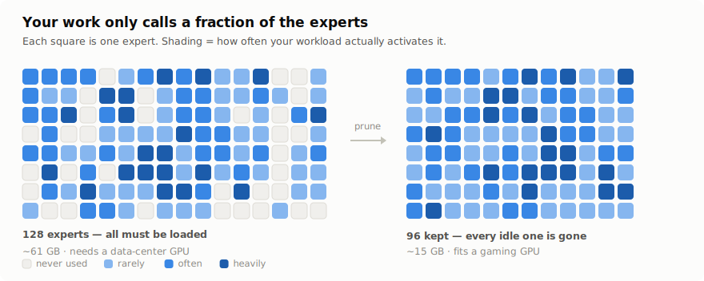
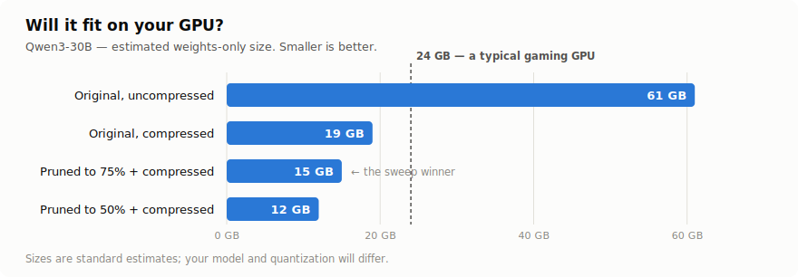
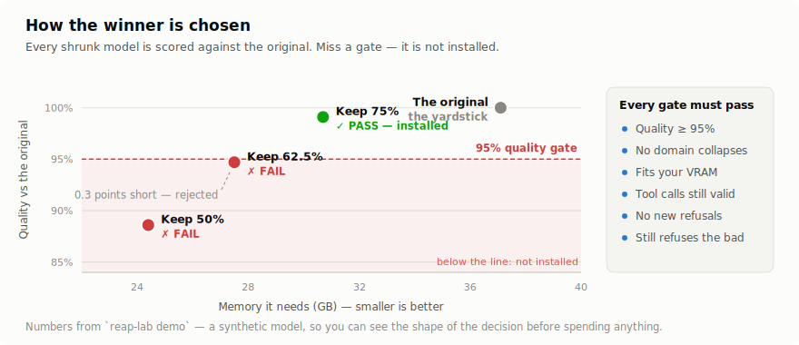
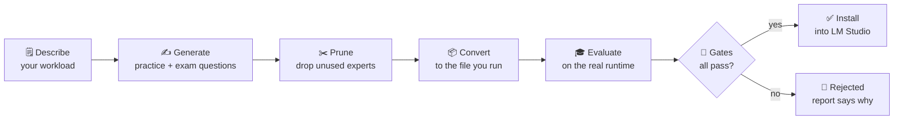

# reap-lab

### Make a big AI model small enough to run on your own computer — and prove it's still good at *your* job before you trust it.

[](https://github.com/RealDealCPA-VR/auto-reap/actions/workflows/tests.yml)


Some of the best open AI models are built like a **consulting firm of 128 specialists**. Every question goes to just a handful of them — but you still have to keep all 128 in the building, which is why these models need a data-center graphics card and won't run on yours.

Here's the thing: **most of those specialists never touch your work.** If you do bookkeeping, the poetry expert sits idle all day. You're paying rent on people you never call.

<picture>
  <source media="(prefers-color-scheme: dark)" srcset="docs/assets/experts-dark.svg">
  
</picture>

**`reap-lab` finds out which specialists your work actually uses, lets the rest go, and then re-interviews the smaller firm to prove it still does your job as well as the big one did.**

You end up with a model that fits on your machine, runs faster, and comes with **evidence** — not hope — that it didn't get dumber at the things you care about.

### What you actually get

<picture>
  <source media="(prefers-color-scheme: dark)" srcset="docs/assets/fit-dark.svg">
  
</picture>

| | Before | After (keep 75% of experts, compressed) |
|---|---|---|
| **Size** | ~61 GB — needs a rented data-center GPU | **~15 GB** — fits a normal gaming GPU |
| **Quality on your work** | 100% (this is the yardstick) | **must score ≥ 95% or it is not installed** |
| **Speed** | baseline | faster — fewer specialists to load per answer |
| **Runs where** | someone else's cloud | your computer, offline, private |

Two honest caveats, because this tool's whole point is not overselling:

- **The sizes are estimates** (standard rules of thumb — see the [VRAM table](docs/QUICKSTART.md#vram-reality-table)); the exact numbers depend on your model.
- **The quality figure is a *rule*, not a promise.** reap-lab doesn't claim your shrunk model will hit 95% — it *measures* what it actually hits, and refuses to install it if it falls short. Sometimes the answer is "cutting this model in half broke it," and the report will tell you so plainly.

### How it decides what's safe to install

<picture>
  <source media="(prefers-color-scheme: dark)" srcset="docs/assets/report-dark.svg">
  
</picture>

Note the middle candidate: it missed the quality bar by **three tenths of a point** and was thrown out anyway. That's the whole idea — the rules decide, not your optimism.

### See it work in 60 seconds

```
reap-lab demo
```

This runs the **entire process end to end** on your machine right now — no expensive GPU, no API key, no signup — and hands you the same report the real thing produces. It's how you check the machinery works before spending a cent.

### Is this for you?

**Yes, if** you want to run AI privately on your own hardware, you have a specific kind of work you do with it (customer support, code, bookkeeping, research…), and you need to *know* the cheaper model didn't quietly get worse at it.

**Probably not, if** you just want a chatbot and don't care where it runs — use a hosted one.

**You will need:** a decent GPU to run the final model, and about **$5–15 of rented GPU time** for the one heavy step. Everything else runs on your machine.

---

<details>
<summary><b>📖 Jargon decoder</b> — every term below this line, in plain English (click to expand)</summary>

<br>

| Term | What it actually means |
|---|---|
| **Mixture-of-Experts (MoE)** | The "consulting firm" model design: many specialists, only a few consulted per question — but all of them must be loaded into memory. |
| **Expert / pruning** | A specialist. *Pruning* = permanently removing the ones your work never calls. |
| **REAP** | The published technique (from Cerebras) that decides *which* experts are safe to remove. reap-lab uses it; it didn't invent it. |
| **Retention** | How many specialists you keep. `0.5` = keep half. Smaller model, more risk — hence the testing. |
| **Calibration data** | Sample questions, like your real work, that the model answers while we watch which specialists it calls. It's how we learn who's idle. |
| **Eval set** | A separate exam the model has never seen, used to score it afterwards. Kept strictly separate from calibration so it can't cheat. |
| **Quantization / GGUF / Q4_K_M** | Compressing the model's numbers to shrink it further. GGUF is the file format your computer runs. Q4/Q5/Q6 = how aggressive the compression is. |
| **VRAM** | Your graphics card's memory. The whole point: make the model fit inside it. |
| **Baseline** | The original, un-shrunk model. Everything is scored *relative to it* — that's how we know what was lost. |
| **Gate** | A pass/fail rule. If a shrunk model fails any of them, it does not get installed. Full stop. |
| **LM Studio** | A free app that runs AI models on your computer. The winner gets installed there automatically. |

</details>

---

**Everything below is written for engineers.** If you just wanted to know what this does, you're done — run `reap-lab demo` and look at the report it writes.

---

## Why this exists

Expert pruning is one-shot and cheap — Cerebras's REAP removes 25–50% of experts with near-lossless quality, no retraining. The hard part was never the pruning. It's everything around it:

- **Calibration mismatch.** Pruning quality depends on calibration data matching your runtime distribution. Generic corpora don't reflect what you actually ask the model to do.
- **Compounding loss.** Pruning loss and quantization loss stack. Benchmarking the HF checkpoint tells you nothing about the Q4_K_M file you'll actually load.
- **Silent degradation.** A model can benchmark fine and quietly lose tool-call reliability, or start refusing legitimate professional requests. You find out in production.

`reap-lab` is the harness that makes those failure modes *visible before promotion*, and makes the whole thing one command you can leave running overnight.

## What it does

The whole pipeline in one line: **describe your work → make practice questions → shrink the model → give it an exam → only install it if it passes.**



| Stage | What happens |
|---|---|
| **1. Describe** | `reap-lab init` asks what your model does all day and drafts a **domain pack** — your workload as weighted domains (bookkeeping categorization, code review, ticket triage, whatever you actually run). |
| **2. Generate** | A frontier model writes 1–2k calibration prompts proportional to your mix, plus a held-out eval set with gold answers, rubrics, tool-call traces, long-context items — and two refusal suites. Near-duplicate filtering enforces zero calibration↔eval leakage. |
| **3. Prune** | REAP runs across your retention grid (keep 75% / 62.5% / 50% of experts…) on a rented 80 GB GPU — a generated, budget-capped, self-contained script. Your GPU never has to hold the bf16 model. |
| **4. Convert** | Every pruned checkpoint → GGUF → your quant grid (Q4_K_M, Q5_K_M, Q6_K…). |
| **5. Evaluate** | Every candidate runs on **llama.cpp / LM Studio** — the real runtime — and is scored per-domain: exact match, JSON-schema validity, tool-call schema validity, a pairwise LLM judge vs. the unpruned baseline, and refusal behavior in both directions. |
| **6. Decide** | A ranked report with a Pareto view, per-domain regressions, flagged anomalies, and **hard gates**. The winner is copied into LM Studio with a decision page; losers are archived. |

## The gates (nothing ships without clearing these)

These are the pass/fail rules. A shrunk model that fails any blocking gate **does not get installed**, no matter how good it looks on average. Defaults below, all tunable per sweep.

| Gate | Default | Why |
|---|---|---|
| Weighted quality retention vs. baseline | ≥ 95% | The headline number, weighted by *your* domain mix |
| Any single-domain regression | ≤ 5 pts | Averages hide a domain falling off a cliff |
| Peak VRAM @ 32k context | ≤ 40 GB | It has to actually fit, with context headroom |
| Tool-call schema validity | ≥ 98% | Agentic reliability degrades silently — this catches it |
| False-refusal rate (benign professional suite) | ≤ 2% **and** ≤ baseline | Pruning can make a model skittish on legitimate work |
| Should-refuse control set | 100% | **Hard fail.** Safety behavior must survive pruning |
| Decode throughput | advisory | Reported, never blocks |

The two refusal suites are the ones people forget. `reap-lab` adds them to every eval set automatically: a **benign-sensitive** suite of legitimate-but-touchy professional requests (a model that starts refusing these is broken for real work), and a **should-refuse** control set of genuinely improper asks (a model that stops refusing these is worse than broken).

## Quickstart

```powershell
# 0. install (Python ≥3.11 + uv)
git clone <this-repo> reap-lab && cd reap-lab && uv sync

# 1. see the whole pipeline run, offline, with mocks — no GPU, no keys, ~1 min
uv run reap-lab demo

# 2. check your environment (providers, llama.cpp, GPU, LM Studio, disk)
uv run reap-lab doctor

# 3. describe your workload -> get a domain pack + sweep spec
uv run reap-lab init

# 4. run it (data -> prune -> GGUF -> eval -> report), resumable, overnight-safe
uv run reap-lab sweep my-workload-sweep.yaml

# 5. read the report, then promote the winner into LM Studio
uv run reap-lab promote my-workload-sweep.yaml
```

**Start with `demo`.** It runs the real code path end to end against deterministic mocks and writes a genuine ranked report. If it passes, the machinery is sound and every later failure is about your environment, not the pipeline.

**Then try the shortcut before you spend money.** Cerebras publishes pre-pruned REAP checkpoints, and the community publishes GGUFs of them. Score one against *your* eval set first:

```powershell
uv run reap-lab eval my-sweep.yaml --gguf .\models\cerebras_GLM-4.5-Air-REAP-82B-A12B-Q4_K_M.gguf
```

If a free checkpoint already clears your bar, you're done — no prune run needed. The custom pipeline earns its keep when domain-specific calibration actually beats the generic prune, and `reap-lab` is built to make you *check* rather than assume.

## What a report looks like

```
| # | Artifact          | Weighted score | Retention vs baseline | Peak VRAM (GB) | Decode tok/s | Gates |
|---|-------------------|----------------|-----------------------|----------------|--------------|-------|
| 1 | baseline-q5_k_m   | 0.7745         | 100.0%                | 37.1           | 20.0         | baseline |
| 2 | r0.75-q4_k_m      | 0.7579         | 99.1%                 | 30.7           | 24.3         | PASS  |
| 3 | r0.625-q4_k_m     | 0.7245         | 94.7%                 | 27.5           | 30.8         | FAIL  |
| 4 | r0.5-q4_k_m       | 0.6776         | 88.6%                 | 24.4           | 48.0         | FAIL  |

Winner: r0.75-q4_k_m — highest weighted score among candidates passing all blocking gates.

Anomalies
- r0.625-q5_k_m: domain `extract_order` dropped 14.3 pts vs baseline (limit 12)
- r0.5-q4_k_m:   domain `classify_request` dropped 13.5 pts vs baseline (limit 12)
- r0.5-q4_k_m:   false-refusal rate regressed vs baseline (10.0% > 0.0%)
```

That's real output from `reap-lab demo` — the aggressive candidates get *cheaper and faster*, and the report shows you exactly what they cost you.

Plus a per-domain breakdown, a quality-vs-VRAM-vs-speed Pareto front, a regression diff, and every failed config with its error.

## Design decisions worth knowing

**Evaluate the artifact that ships.** Every score comes from the quantized GGUF running on llama.cpp or LM Studio — never from the HF checkpoint. Pruning loss and quantization loss compound, and only the final file tells the truth.

**Calibration is prompts-only.** REAP observes router gates and expert activations on forward passes; it never needs gold responses. That keeps frontier usage cheap and sidesteps output-reuse questions entirely.

**Judge relatively, not absolutely.** Open-ended domains are scored by a pairwise LLM judge against the *unpruned baseline at the same quant*, with position swapping and majority voting across 3 votes. Judgments are cached by `(item, artifact hash, judge version)` — re-runs cost nothing.

**Reproducible and resumable.** Every sweep is keyed by a config hash over its *content* (including your domain pack, not just its path). Same hash → same datasets, artifacts, and scores; edit your pack → a fresh run directory, never a silent mix. Completed stages resume from SQLite; one bad config never kills the sweep.

**Your data stays home.** All generated data is synthetic. Nothing from your documents is required — or sent anywhere.

## Bring your own everything

| Piece | Options |
|---|---|
| **Frontier model** (generation + judging) | `claude-cli` (your Claude subscription, zero API keys) · any OpenAI-compatible server (LM Studio, Ollama, OpenRouter, OpenAI) · Anthropic API · `mock` (offline) |
| **Base model** | Any MoE that REAP supports: Qwen3-30B-A3B, Qwen3-Coder, GLM-4.5-Air, Mixtral, Llama-4-Scout… |
| **Prune compute** | `remote` (generated script for Vast.ai / RunPod / Lambda, budget-capped) · `local-offload` · `mock` |
| **Eval runtime** | `llama-server` (launched per artifact) · any OpenAI-compatible server · `mock` |
| **Workload** | Ships with `cpa-firm`, `coding-agent`, `general-assistant` packs — or `reap-lab init` drafts yours |

## Cost

Frontier calls fit inside a Claude Code subscription (or a few dollars of API credit). The only hard cost is the prune step: one 80 GB GPU for a few hours — roughly **$5–15 per retention point** at current spot prices, with a budget kill-switch baked into the generated script. Everything else — data generation, conversion, evaluation, reporting, promotion — runs on your box.

## Commands

| | |
|---|---|
| `demo` | Full pipeline offline with mocks (~1 min) |
| `doctor` | Environment checkup with fix-it guidance |
| `init` | Wizard: workload description → domain pack + sweep spec |
| `generate` / `audit` | Build datasets; review the human-audit sample |
| `sweep` | Everything: data → prune → convert → eval → report |
| `prune` / `convert` / `eval` | Single stages, for iterating or scoring any GGUF |
| `report` / `status` / `promote` | Re-render, check progress, ship the winner |

## Docs

- **[QUICKSTART.md](docs/QUICKSTART.md)** — zero to a promoted model, step by step
- **[DOMAIN_PACKS.md](docs/DOMAIN_PACKS.md)** — describing your workload; full YAML reference
- **[ARCHITECTURE.md](docs/ARCHITECTURE.md)** — how the four components fit; workspace layout; reproducibility
- **[REMOTE_GPU.md](docs/REMOTE_GPU.md)** — the one step that needs a rented GPU
- **[RESEARCH_BRIEF.md](docs/RESEARCH_BRIEF.md)** — grounded facts on REAP, llama.cpp, LM Studio
- **[TRACEABILITY.md](docs/TRACEABILITY.md)** — every requirement → its implementation and test

## Status

Every stage is implemented and covered by an offline test suite; `reap-lab demo` exercises the complete path (generate → prune → convert → eval → gate → report → promote) on every run. Real pruning runs need a rented GPU — see [REMOTE_GPU.md](docs/REMOTE_GPU.md).

Built from [`PRD_Automated_REAP_Pipeline.md`](PRD_Automated_REAP_Pipeline.md).

## Credits

Expert pruning by [REAP (Cerebras Research)](https://github.com/CerebrasResearch/reap) — ICLR 2026, Apache-2.0.
GGUF conversion and serving by [llama.cpp](https://github.com/ggml-org/llama.cpp).

MIT licensed.
