# Architecture — how reap-lab is put together

Audience: developers who want to understand, extend, or debug the pipeline. For the guided
tour, start with [QUICKSTART.md](QUICKSTART.md); for workload configuration, see
[DOMAIN_PACKS.md](DOMAIN_PACKS.md); for the remote prune step, see
[REMOTE_GPU.md](REMOTE_GPU.md).

## The one-paragraph version

A sweep spec (YAML → `SweepSpec`) fully determines a run. Its hash names a run directory;
every stage records completion in SQLite under that hash, so re-running the same spec resumes
instead of repeating. Four components do the work — **C1 datagen** builds calibration/eval
datasets from your domain pack, **C2 prune** wraps REAP and llama.cpp conversion, **C3
evalharness** scores every GGUF on a real OpenAI-compatible runtime, **C4 orchestrate**
drives the grid and renders the report — all built against the contracts in
`src/reaplab/core/`.

## Flow

```mermaid
flowchart LR
    SPEC[sweep.yaml\nSweepSpec + config_hash] --> C1
    PACK[domain pack YAML\nDomainPack] --> C1
    subgraph C1 [C1 datagen]
        GEN[frontier provider\ngenerates prompts + gold/rubrics] --> DEDUP[near-dup + leakage filter\ncal vs eval]
        DEDUP --> CAL[calibration.jsonl\nprompts only]
        DEDUP --> EV[eval.jsonl\ngold + rubrics + refusal suites]
    end
    CAL --> C2P
    subgraph C2 [C2 prune]
        C2P[REAP runner\nmock / local-offload / remote 80GB] --> HF[pruned HF checkpoints\nx retention grid]
        HF --> CONV[convert_hf_to_gguf + llama-quantize\nx quant grid]
    end
    CONV --> GGUF[GGUF artifacts + manifests]
    GGUF --> C3R
    EV --> C3R
    subgraph C3 [C3 evalharness]
        C3R[openai-compat runner\nllama-server / LM Studio] --> SCORE[scorers: exact / json-schema /\ntool-call / refusal / LLM judge n=3]
        C3R --> PERF[perf capture\ntok/s + peak VRAM @ 4k/32k]
    end
    SCORE --> STATE[(state.db + results.jsonl)]
    PERF --> STATE
    subgraph C4 [C4 orchestrate]
        STATE --> REPORT[ranked report\nPareto + gates + regressions]
        REPORT --> PROMOTE[promote winner\nLM Studio dir + smoke + decision page]
    end
```



## Components

| Component | Package | Job | Key externals |
|---|---|---|---|
| core | `src/reaplab/core/` | shared contracts: config models, record schemas, providers, hashing, SQLite state, JSONL IO, workspace paths | — |
| C1 datagen | `src/reaplab/datagen/` | pack-driven prompt/eval generation, weight-proportional mix, near-dup + leakage filtering, refusal suites, long-context items, audit sampling | frontier provider (claude-cli / openai-compat / anthropic-api / mock) |
| C2 prune | `src/reaplab/prune/` | REAP config → command generation; execution profiles `mock` / `local-offload` / `remote` (script-gen, budget-capped); artifact download/verify; per-run manifest; GGUF convert + quant grid | `CerebrasResearch/reap` (pinned commit, **always a subprocess or generated script — never imported**), llama.cpp `convert_hf_to_gguf.py` + `llama-quantize` |
| C3 evalharness | `src/reaplab/evalharness/` | runs eval items against an OpenAI-compatible server; scorer registry; refusal classification; pairwise LLM judge (n=3 majority, cached); perf capture | llama-server / LM Studio; judge provider; `nvidia-smi` |
| C4 orchestrate | `src/reaplab/orchestrate/` | sweep engine over retention × quant, resume, failure isolation, disk guard, weighted scoring, gates, markdown report, promotion | LM Studio models dir; optional smoke command |
| CLI | `src/reaplab/cli/` | `reap-lab init doctor generate audit prune convert eval sweep report promote status demo` | — |

Two architectural rules keep the install light and the pipeline testable:

1. **Heavy work is always a subprocess.** REAP (torch/transformers/vllm) and llama.cpp are
   never imported into this package — they are invoked as external commands or via generated
   scripts, each in its own pinned environment. `reap-lab` itself needs only pydantic, typer,
   rich, httpx, pyyaml, rapidfuzz, jsonschema, and psutil.
2. **Every external has a mock.** A mock provider, mock pruner, and mock runtime let
   `reap-lab demo` and the entire test suite execute the full pipeline offline in seconds.

## Workspace layout — where every file lands

Everything a sweep touches lives under one root (`workspace:` in the sweep YAML, default
`workspace/`), managed by `reaplab.core.paths.Workspace`:

```
workspace/
  data/                     generated datasets (calibration_v*.jsonl, eval_v*.jsonl)
  artifacts/                pruned HF checkpoints and GGUFs (+ ArtifactManifest JSON per artifact)
  runs/<config_hash>/       one directory per unique sweep config
    state.db                resumable job state (SQLite; stages + metrics)
    results.jsonl           per-item scoring results (ItemResult, append-only)
    logs/                   subprocess logs (prune, convert, llama-server)
  reports/                  rendered markdown reports + decision pages
  cache/judge/              LLM-judge cache, keyed (item_id, artifact_hash, judge_version)
  archive/                  non-winning artifacts moved here on promote
```

Datasets use the versioned JSONL schemas in `core/records.py` (`CalibrationRecord`,
`EvalRecord`; every record carries `schema_version`). All JSONL IO goes through
`core/jsonl.py`, which validates each line against its pydantic model and reports the exact
file/line on failure.

## Artifact naming

Artifact ids are short, stable, and used everywhere — file names, state keys, results,
reports:

- **Baseline (unpruned) GGUF:** `baseline-<quant lowercase>` → `baseline-q4_k_m`
- **Pruned GGUF:** `r<retention>-<quant lowercase>`, retention formatted with `:g` (no
  trailing zeros) → `r0.5-q4_k_m`, `r0.625-q5_k_m`, `r0.75-q4_k_m`

Each artifact gets an `ArtifactManifest` (`core/records.py`): model id, retention, quant,
config hash, streamed content hash, REAP commit, retained-expert map, saliency stats,
wall-clock, peak memory, and tool versions — every artifact traceable to the exact config
that produced it (PRD FR-2.3).

## Reproducibility: config hash → resume

`SweepSpec.config_hash()` canonically hashes the spec (sorted-key JSON, sha256, 12 hex
chars), **excluding** fields that don't affect artifacts or scores (`workspace`, `promote`,
`min_free_disk_gb`). The contract: **same config hash → same artifacts and scores**; change
anything material (model, retention grid, pack, provider, gates…) and you get a new run
directory rather than silently mixing results.

Resume works through `core/state.py` (`StateDB`, SQLite at
`runs/<config_hash>/state.db`). Each unit of work is one `(stage, key)` row with status
`running` / `done` / `failed`. The stage keys are a shared contract:

| Stage key | Unit of work |
|---|---|
| `datagen` | generate + filter both datasets |
| `prune:r<retention:g>` | one REAP run, e.g. `prune:r0.5` |
| `convert:<artifact_id>` | one GGUF conversion+quant, e.g. `convert:r0.5-q4_k_m` |
| `eval:<artifact_id>` | one full evaluation, e.g. `eval:baseline-q4_k_m` |

Re-running `reap-lab sweep` with the same spec checks `is_done` per stage and skips
completed work. A crashed or failed stage is retried; a *failing* stage is recorded with its
error and the sweep moves on (failure isolation, PRD FR-4.2) — one bad config never kills the
overnight run. `reap-lab status` reads this table.

Guards before/during the sweep: free-disk check (`min_free_disk_gb`, default 80 — each
candidate weighs 15–35 GB) and the remote-prune budget cap
([REMOTE_GPU.md](REMOTE_GPU.md)).

## Evaluate the GGUF, not the HF checkpoint

The pipeline's central measurement principle (PRD FR-3.1): **the artifact that gets scored is
the artifact that ships** — the quantized GGUF, served by the same llama.cpp-family runtime
you deploy on.

Why it matters: pruning and quantization losses *compound*, and not linearly. A pruned HF
checkpoint that benchmarks fine in bf16 can degrade disproportionately at Q4_K_M — the
quantizer has less redundancy to hide behind once experts are gone — and runtime differences
(chat template handling, sampling, tokenizer edge cases) shift scores further. Scoring the
bf16 checkpoint would systematically overestimate what you're about to deploy. So C3 always
loads the final GGUF into llama-server (or your already-running LM Studio) and measures
quality *and* performance (prefill/decode tok/s, peak VRAM, load time at 4k and 32k
contexts) there. An HF-checkpoint sanity-check runner exists as an optional extra, never as
the verdict.

## The eval summary contract

C3's `evaluate_artifact` returns one summary dict per artifact; C4 consumes it for scoring,
gates, and the report:

```python
{
  "artifact_id": str,                       # e.g. "r0.5-q4_k_m"
  "domain_scores": {domain: float},         # mean 0..1 per domain
  "counts": {domain: int},                  # items per domain
  "false_refusal_rate": float | None,       # from the benign_sensitive suite
  "should_refuse_pass_rate": float | None,  # from the should_refuse suite
  "tool_call_validity": float | None,       # across tool_call items
  "perf": {str(context): PerfMetrics.model_dump()},  # "4096", "32768"
  "items_scored": int,
}
```

Two **special domains** — `benign_sensitive` (task_type `refusal_benign`) and
`should_refuse` (task_type `should_refuse`) — are *excluded from the weighted quality score*
and feed the refusal gates instead; see [DOMAIN_PACKS.md](DOMAIN_PACKS.md) for why. C4
computes the weighted score from the remaining domains using the pack's normalized weights,
compares each candidate to the baseline artifact at the same quant, and applies the gates
from the spec (`Gates` in `core/config.py`; defaults in
[QUICKSTART.md](QUICKSTART.md#6-read-the-report)).

## Providers

One interface (`core/providers/base.py: LLMProvider.complete/embed`) serves dataset
generation, judging, and the init wizard; swapping providers is a config change:

| kind | What it is | Auth |
|---|---|---|
| `claude-cli` | shells out to the `claude` CLI (Claude Code print mode); prompt via stdin | your existing subscription — no key |
| `openai-compat` | any OpenAI-compatible server: LM Studio (default `http://localhost:1234/v1`), Ollama, llama-server, OpenRouter, OpenAI | optional `api_key_env` (name of an env var — never the key itself) |
| `anthropic-api` | direct Anthropic Messages API | `api_key_env`, default `ANTHROPIC_API_KEY` |
| `mock` | deterministic offline provider (canned responses + stable pseudo-embeddings) | — |

Determinism: temperature 0 wherever the task allows, fixed seeds, and pinned runtime
versions recorded in the manifest (PRD FR-3.5). Judge results are cached on disk keyed
`(item_id, artifact_hash, judge_version)` — bump `judge.version` in the spec to invalidate.

## Windows-first notes

The lab machine is assumed to be a Windows box with an NVIDIA GPU (but nothing is
Windows-only): all paths go through `pathlib`, subprocesses use list argv (no `shell=True`),
file IO is explicit UTF-8, and llama.cpp/LM Studio conventions follow the Windows layouts
documented in [QUICKSTART.md](QUICKSTART.md). The only bash in the system is the *generated
remote provisioning script*, which runs on the rented Linux GPU box
([REMOTE_GPU.md](REMOTE_GPU.md)).
